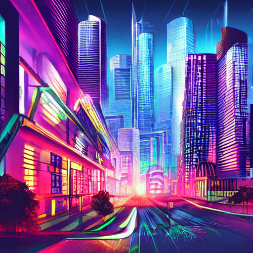
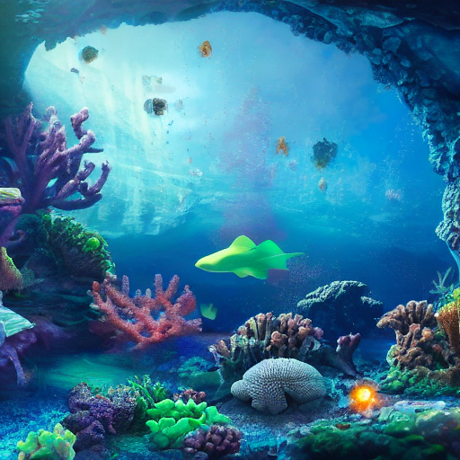

# stable-diffusion

This project uses the [Stable Diffusion model](https://huggingface.co/CompVis/stable-diffusion-v1-4) to generate images from text prompts. It leverages the [diffusers](https://github.com/huggingface/diffusers) library.


## Installation

```sh
pip install torch==2.2.2 diffusers==0.3.0 python-dotenv==1.0.1
```

## Setup

Rename a [`.env-example`](.env-example) file to `.env` add your [huggingface authentication token](https://huggingface.co/docs/hub/en/security-tokens#user-access-tokens):

```sh
AUTH_TOKEN=your_huggingface_auth_token
```

## Usage

Run the script with a text prompt:

```sh
python3 main.py "A futuristic cityscape with neon lights"
```

Optionally, specify an output path:

```sh
python3 main.py "A futuristic cityscape with neon lights" --output "city.png"
```

## Example Usages  

| Prompt | Image |  
|--------|-------|  
| A futuristic cityscape with neon lights |  |  
| A mystical underwater kingdom with glowing coral reefs and futuristic submarines, 4K |  |  
| A quiet beach at sunset with waves gently touching the shore, 4K |  |  
| A vintage motorcycle parked on an empty road surrounded by autumn trees, 4K |  |  

